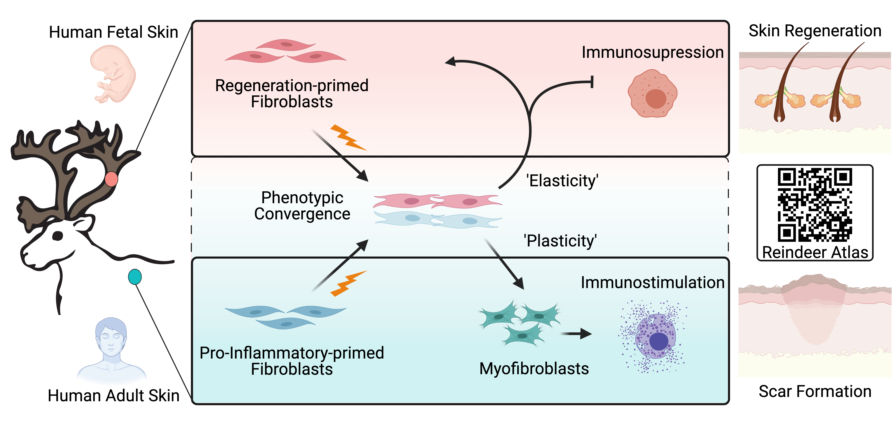

# Welcome
Reproducibility repository accompanying 'Skin regeneration is enabled in the absence of fibroblast inflammatory priming' (Under Review). Single-cell datasets can be visualized on our [Reindeer Atlas](http://www.biernaskielab.ca/reindeer_atlas/).

# Summary

## Abstract
In adult mammals, skin wound healing has evolved to favor rapid repair through formation of fibrotic scar, leading to chronic impairment. Mechanisms that drive fibrosis and prevent tissue regeneration remain unknown. Here, we report that reindeer (_Rangifer tarandus_) antler velvet exhibits regenerative wound healing, whereas identical full-thickness injury in back skin forms fibrotic scar. This remarkable regenerative capacity is retained even following ectopic transplantation of velvet to a scar-forming site. Single-cell RNA- and ATAC-Seq of uninjured skin revealed a marked divergence in resting fibroblast states and immunomodulatory function. Uninjured velvet fibroblasts shared a striking similarity to human fetal fibroblasts whereas back skin fibroblasts were enriched for pro-inflammatory genes resembling adult human fibroblasts. Injury resulted in site-specific fibroblast polarization; back skin fibroblasts amplified the inflammatory response, whereas velvet fibroblasts adopted an immunosuppressive state leading to an accelerated adoption of anti-inflammatory immune states and expedited resolution of immune response. Consequently, velvet fibroblasts underwent fate reversion to readopt their native regeneration-competent ground state. This study highlights reindeer as a powerful comparative model of adult mammalian skin regeneration and fibrosis, highlighting the importance of fibroblast heterogeneity in shaping local immune milieu to determine wound healing outcomes. Purposeful decoupling of stromal-immune crosstalk and reinforcement of fibroblast regenerative programming represent important therapeutic avenues to mitigate scarring and improve regenerative wound healing.

## Highlights:
1. Skin wounds on reindeer velvet regenerate whereas wounds on reindeer backskin form scar.
2. Velvet is comprised of fetal-like fibroblasts whereas backskin harbors pro-inflammatory fibroblasts.
3. Fibroblast fate reversion and immunosuppression drives skin regeneration.
4. Inflammatory fibroblasts exacerbate immune response and myeloid maturation during scarring.
5. Pro-inflammatory fibroblast cytokines (PLAU, PDG, CSF1, CXCL3, CCL2) ameliorate velvet regeneration.

# Data

